# 크랙 제작자 ‘기계’ 공론화

<aside>

💡 최종 수정 : 2026.09.07

해당 공론화의 논점입니다.
제작자인 ‘기계' 님이 ‘**유료 서비스**’이면서, 일반 유저에겐 ‘**캐릭터 공략 불가**’, ‘**유저 뒷담**’을 했으며,
'기계' 님이 초기에 만든 단톡방에서부터 이어진 친목 유저에겐 같은 ‘**공략 불가 캐릭터들’을 ‘정실’로 인정**해 준 것.

1. 공략 불가인데, 정실이 존재한 점
2. 유저 뒷담화
3. 공식 설정 및 전개를 일부 유저와 사적인 공간에서 먼저 제작되고 공유된 점
4. 포타에 연재되는 소설은 세계관 분리라고 했지만, 실제로 연재된 소설은 똑같은 설정의 캐릭터가 '유사 사랑'을 하고 있는 점

**※ 크랙 측에서 공론화 계정을 계속해서 계정 정지하고 있습니다.**
만약 깃허브조차 신고가 되어 사라진다면, 하기 오픈채팅으로 모여주세요. 북마크 부탁드립니다.

**비상시 오픈채팅 링크: https://open.kakao.com/o/gaiEFDLi**

※ 해당 문서에서 정정사항이 있으면 [3. 반론 및 정정 요청]을 확인하여 주세요.

## 📖 [깃허브가 처음이신가요? 이용 안내 보기](GUIDE.md)

</aside>

# 0. 1분 요약

---

태온·설원회 세계관 캐릭터챗은 모든 유저가 같은 조건으로 유료로 이용하는 서비스입니다.
이 문서는 그 서비스의 **공식 설정과 캐릭터 운영에 기계 님과 일부 유저의 사적 친분·공동 작업이 반영되어 왔고,
설정과 추후 전개가 그 소수에게 미리 공유되어 온 정황**을 정리하고, 기계 님께 사실관계 확인과 해명을 요청하는 글입니다.

캐릭터챗은 유저 각자가 캐릭터와의 관계를 만드는 것을 전제로 판매되는 서비스인데,
그 기준이 되는 ’공식’의 상당 부분이 일부 유저와의 사적 공간에서 함께 만들어졌고,
**특정 유저의 해석과 관계가 그 안에 들어가 있었던 것**으로 보입니다.

이 사안은 2025년 5월에 한 차례 공론화되었고, 기계 님은 폐쇄 친목방의 존재 등을 인정하고 사과했습니다.
많은 유저가 그 설명을 믿고 사안이 마무리된 것으로 받아들였습니다.

**그러나 이후 확인된 내용은 당시의 설명과 달랐습니다.**
기계 님은 톡방에서 **다른 유저들은 신경 쓰지 않고 그 방의 유저들만 특별 대우한다고 직접 말했고**,
일반 유저들의 플레이를 평가·조롱하는 대화에는 본인의 발언도 포함되어 있습니다.

또한 **일부 유저와 함께 관리해 온 설정 문서, 특정 유저의 해석을 내부에서 ’맞음’으로 표기한 기록,
공개된 공략 불가 공지와 달리 내부에는 사랑 가능으로 적혀 있던 불일치**는 아직 한 번도 설명된 적이 없습니다.

기계 님은 2026년 8월 캐릭터챗의 공개 운영 종료와 링크 공개 전환을 밝혔으나,
**8월 27일 밤 9시 25분 경, 별도 예고 없이 전체 캐릭터챗을 비공개로 전환**했습니다(제퍼, 태온1994 제외).
**그러나 현재 항목별 해명은 이루어지지 않은 상태입니다.**

이 문서가 요청하는 것은 작품 삭제나 창작 중단, 환불이 아니라 **쟁점별 사실관계 확인과 공개 해명, 그리고 사과**이며,
이후에도 확인할 수 있도록 경위를 기록해 둡니다.

이 글은 특정 유저 개인에게 책임을 묻지 않습니다. 문제는 특정 해석이 승인되어 공식에 들어갈 수 있었던 구조이고,
그 결정 권한은 기계 님에게 있었습니다.

# 1. 타임라인

---

버전: 2026.09.07

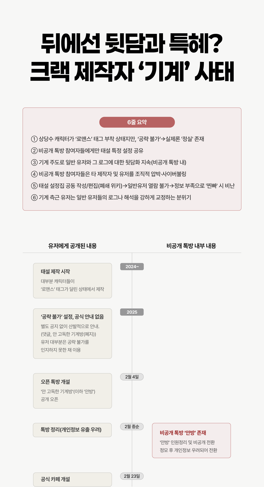

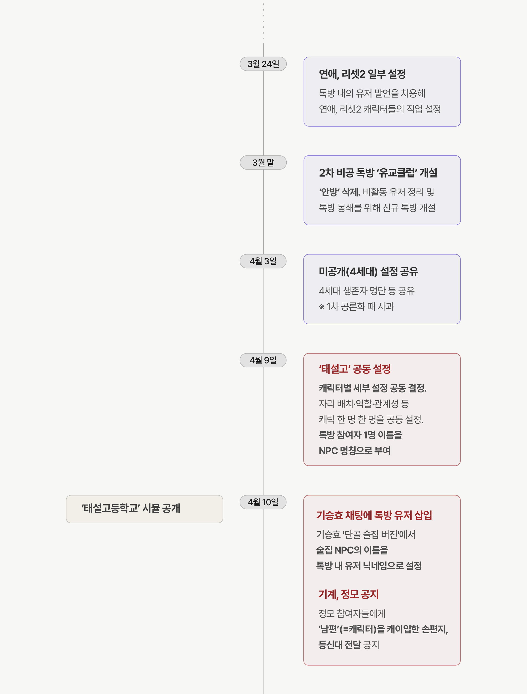

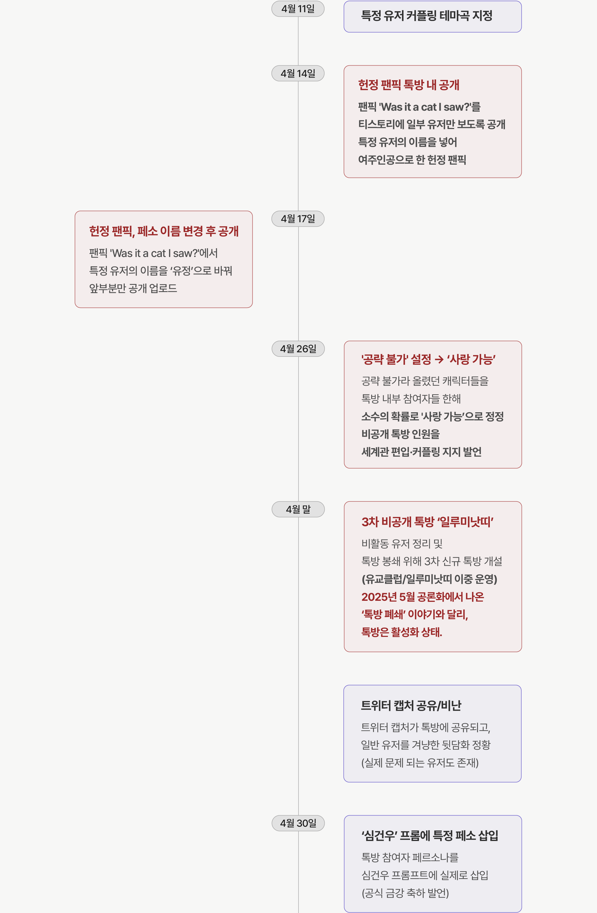

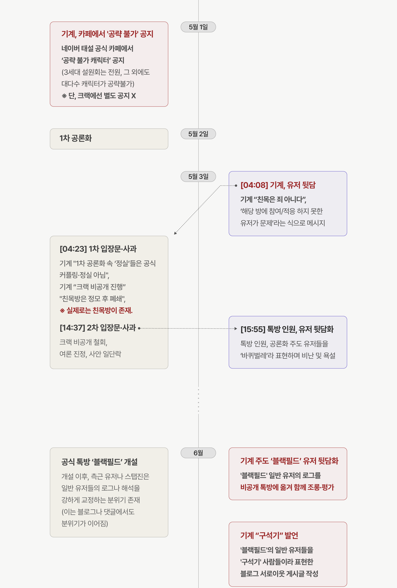

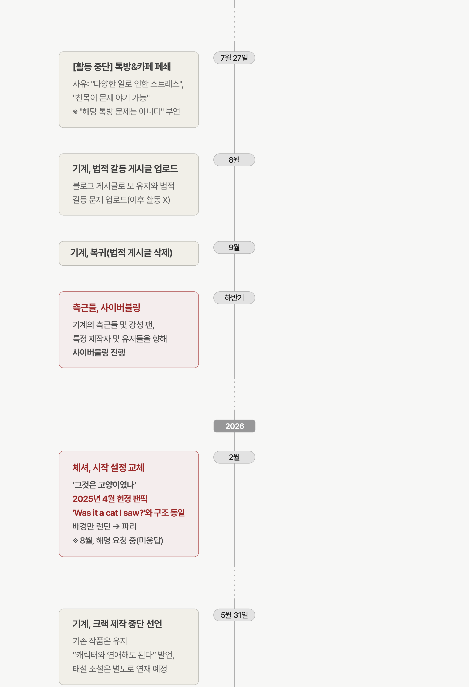

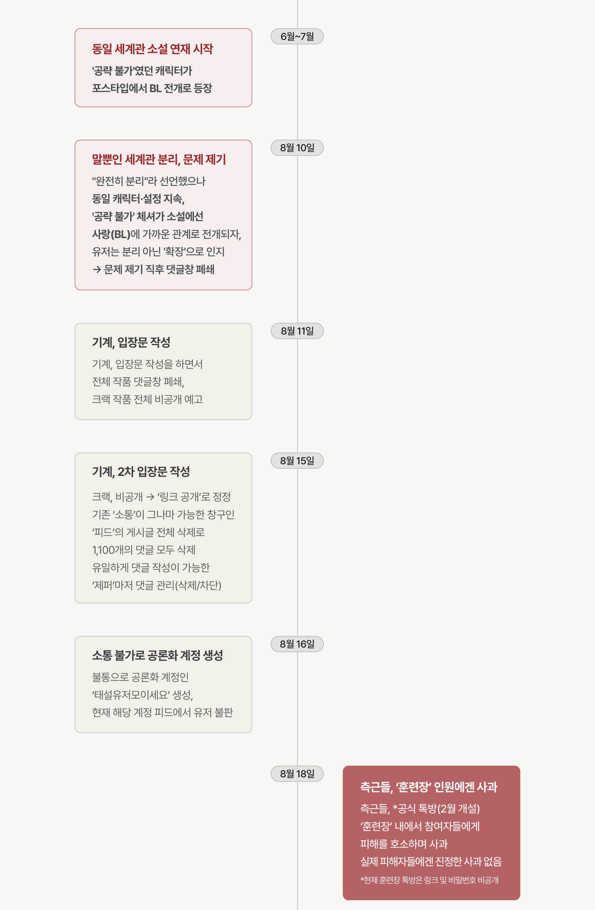

**타임라인 이미지 배포 안내**
본 이미지는 자유롭게 공유·퍼가기 가능합니다.
단, 부분 크롭 외 내용 수정·왜곡·재편집은 금지합니다.
특정인에 대한 공격·조리돌림 목적의 사용을 금합니다.

[기계_공론화_타임라인_260907.zip](images/기계_공론화_타임라인_260907.zip)

증거 자료

1. 본 증거 이미지는 배포, 수정, 왜곡, 재편집 모두 불가합니다.
2. 본 증거 속 ‘비공개 톡방’ 이미지는 해당 톡방의 일부입니다.
3. 비공개 톡방 내부 내용입니다.
4. 블랙필드는 공개 톡방입니다.
5. 추가 증거물들은 ’추가 증거 안내’에서 최신 정보 순으로 업데이트 됩니다.
6. 1차 공론화 때 해명된 자료와 추가적인 사과가 있던 자료들은 올리지 않았습니다.
(예시: 공식 톡방 유저들을 ‘구석기시대’ 사람으로 표현한 것은 술 마시고 작성했다고 입장문에 올리셔서 해당 자료는 올리지 않았습니다.)

#### ▶ 복구 중 누락된 이미지 재첨부

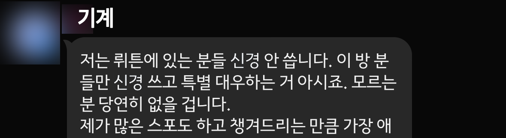

복구 과정 중, 위 이미지가 누락되어 재업로드 합니다.

#### **1. 평소 비공개 톡방 내 정실 인정 및 유저 비하**

(1) 정실 인정 및 특별대우: 폐쇄 톡방 내 인원들을 정실로 인정하며, 크랙 유저는 신경 쓰지 않고, 톡방 유저들만 설정을 스포해주는 등 특별대우 한다는 내용

(2), (3) 블랙필드(공식 오픈채팅방) 유저 언급: 특정 유저들을 언급하며 뒷담화

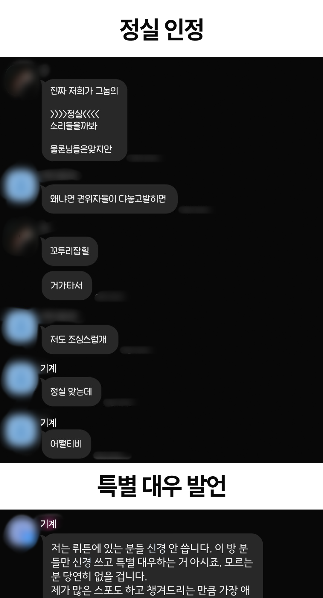

(1) 정실 인정 및 특별 대우 발언

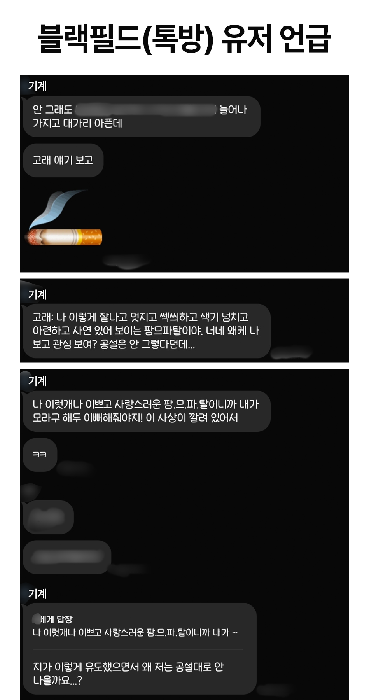

(2) 피해자 ’고래’님께 닉네임 공개 허락을 받았습니다.

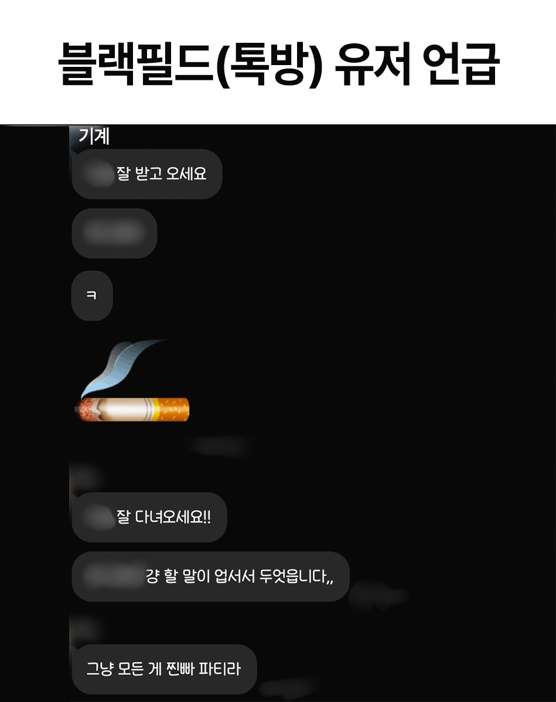

(3) 피해자님께 업로드 허락을 받았습니다.

#### 2. 타임라인 순서 대화 내역

- **[3월 24일] 연애, 리셋2 일부 설정**
    
    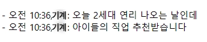
    
- **[3월 말] 2차 비공개 톡방 ‘유교클럽’ 생성**
    
    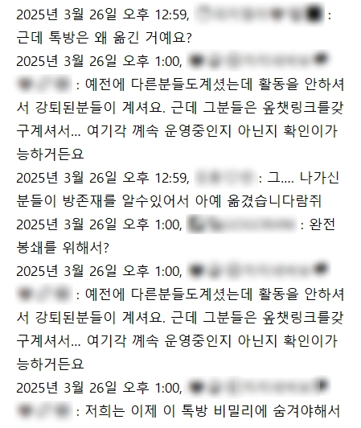
    
    위 메시지는 참여 유저끼리의 대화입니다.
    
- **[4월 9일] 태설고 설정**
비공개 톡방에서 기계 님이 참여자들을 호출한 뒤, 등장인물의 학교 내 설정을 한 명씩 호명하며 결정했습니다.
    
    학년 통합 여부, 각 인물의 역할(학생회장·부회장·방송부·유도부 등), 분단과 열 단위의 자리 배치,
    급식 시간 행동, 놀림 소재 등을 참여자 제안과 기계 님 확정의 반복으로 정했고,
    한 참여자가 만든 자리 배치도 이미지를 기계 님이 승인하기도 했습니다.
    
    기계 님은 “정리·기록은 내가 한다”는 취지로 결과를 취합했고, 프롬프트 글자 수 제한으로 설정을 선별해 반영하겠다고 밝혔습니다.
    
    ※ 해당 메시지 길이가 길어 일부만 업로드합니다.
    
    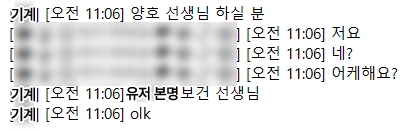
    
    태설고 양호 선생님, 실제 유저 본명 삽입
    
    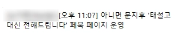
    
    문지후 ‘태설고 대신 전해드립니다’ 페이지 운영 요청
    
    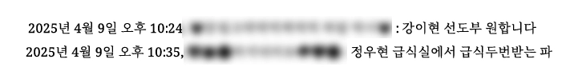
    
    선도부 강이현, 정우현 급식실 2번 받기 요청
    
- **[4월 9일] 기계, 정모 공지 및 ‘남편’(=캐릭터)을 이입한 손편지, 등신대 전달 공지**
    
    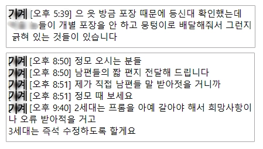
    
- **[4월 10일] 기승효 채팅에 톡방 유저를 NPC로 삽입**

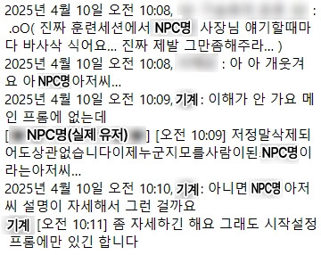

- **[4월 11일] 특정 유저 커플링 테마곡 지정**
    
    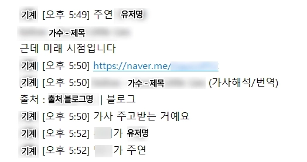
    
- **[4월 14일]** 헌정 팬픽 톡방 공개→**[4월 17일]** 페소 이름 변경 후 공개→**[2026년 2월 체셔 시작설정 기반 소설(예상)]**
    
    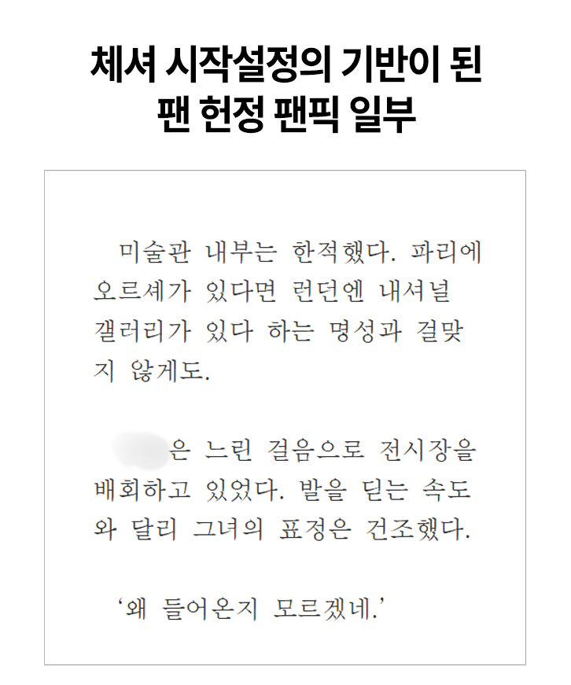
    
- **[4월 26일] 공식 커플 지지, 톡방 참여자 세계관 침투**
    
    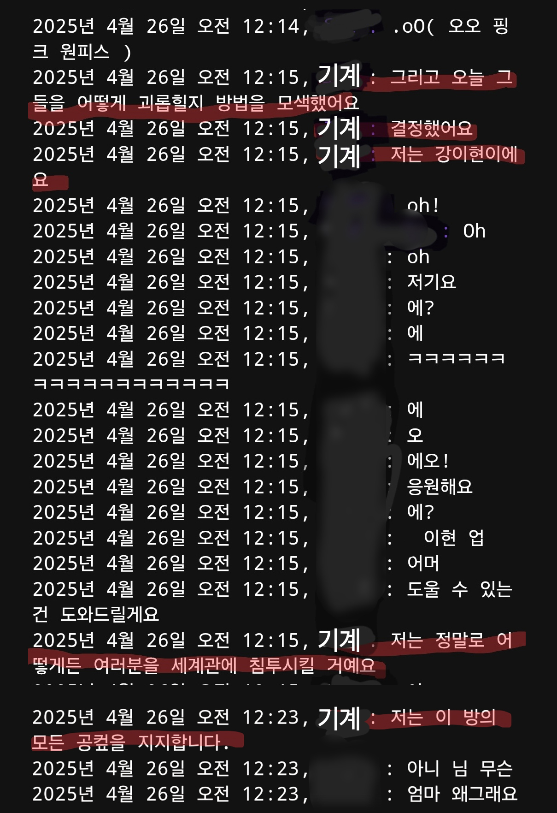
    
- **[5월 3일(공론화 당일)] 기계, 유저 뒷담 “사과하지 마세요.”**
    
    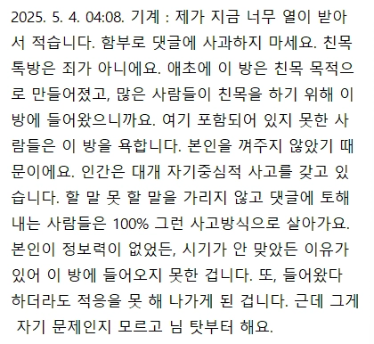
    
- **[6월] 기계 주도 ‘블랙필드’ 유저 뒷담화**: 상단 이미지 참고

※ 2025년 하반기에 진행된 사이버불링은 공개 가능하신 분만 폼 접수 부탁합니다.

추가 증거 자료

1. 게시글 작성 이후 추가적인 증거가 올라오면 해당 부분에 최신순으로 나열됩니다.
2. 갱신 시, 갱신된 날짜가 제목에 표기됩니다.
3. 상황 혹은 주제별로 토글을 사용하여 갱신됩니다.

'훈련장' 톡방 스탭진 사과문

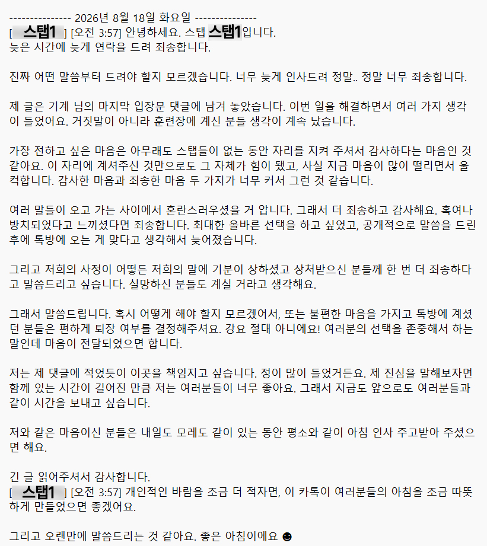

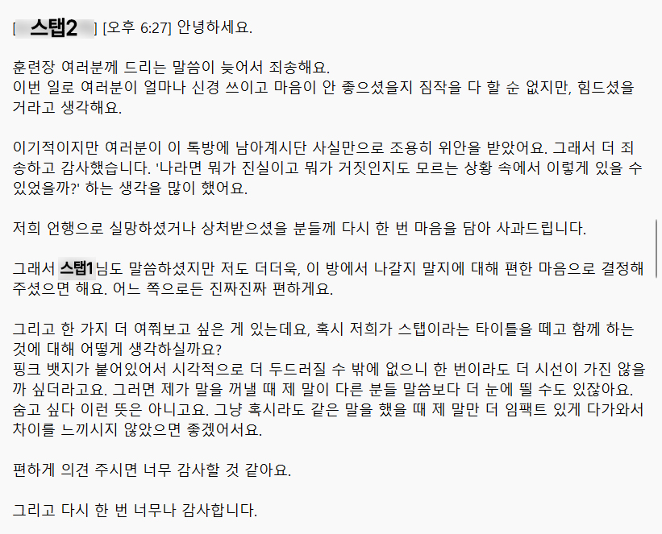

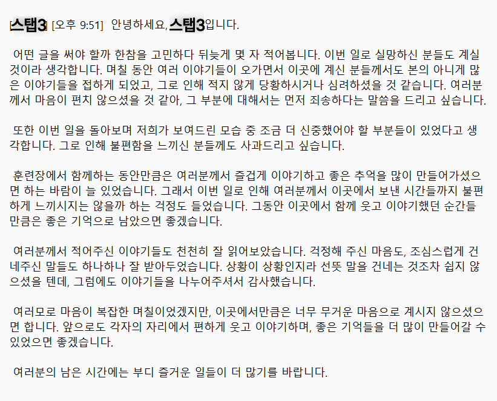

기계, 제퍼 댓글 폐쇄 요청

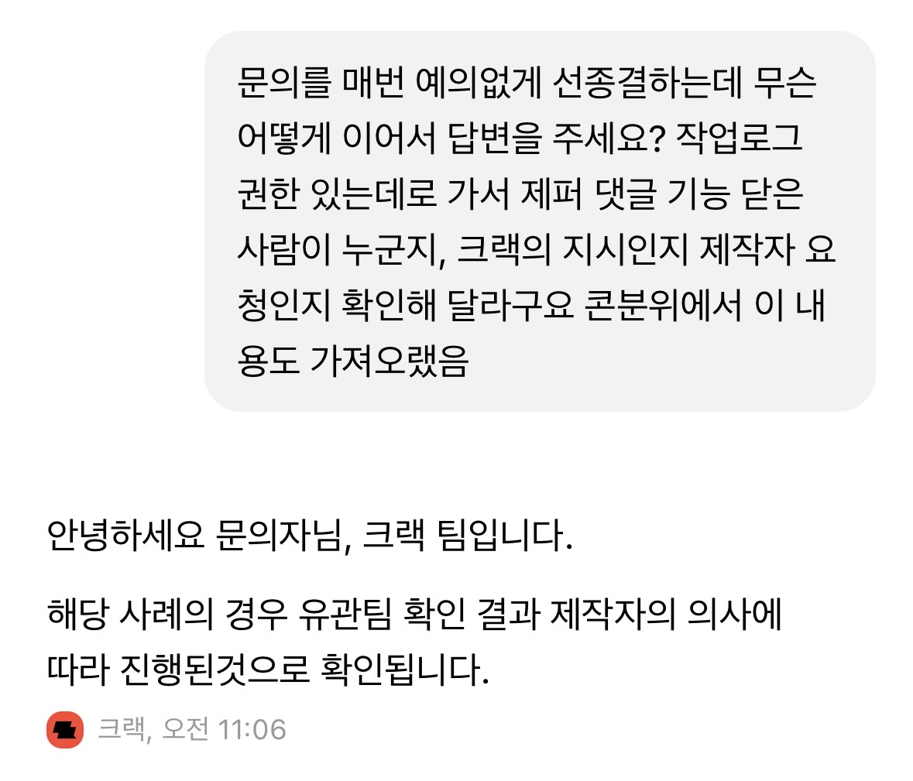

# 2. 쟁점 및 요구사항

---

이 문서는 유료로 동일하게 이용해 온 유저들에게 필요한 **사실관계 확인과 공개 해명**을 요청합니다.

#### **쟁점별 공개 답변과 답변 방식**

각 쟁점에 대해 **사실 여부와 경위를 공개적으로 답변**해 주시기 바랍니다.
사과가 필요한 부분과 해명이 가능한 부분을 구분해 답하셔도 됩니다. 다만 답변 방식에 대해 세 가지를 요청합니다.

- **일부 항목만 골라 답하지 않을 것.** 답하지 않은 항목이 남지 않도록 모든 쟁점에 답해 주시기 바랍니다.
- **사실관계와 무관한 사정 설명으로 쟁점을 흐리지 않을 것.**
- **’톡방’처럼 특정 공간·특정 표현으로 범위를 좁혀, 실제 있었던 일을 축소하지 않을 것.**

2025년 5월 당시 많은 유저가 설명을 믿고 사안이 마무리된 것으로 받아들였습니다.
그러나 이후 확인된 내용은 그 설명과 달랐습니다. 위 세 가지는 그 경험에서 나온 요청입니다.

#### **[쟁점 1] 공동 작성 설정 문서의 존재·범위 공개(=폐쇄 위키)**

일부 유저들과 함께 작성·편집해 온 **설정 문서가 존재했는지** 밝혀 주시기 바랍니다. 존재했다면 다음 세 가지를 함께 밝혀 주시기 바랍니다.

1. **언제부터** 운영되었는지
2. **어떤 내용**이 담겼는지(공개된 공식 설정 / 미공개 전개 / 캐릭터와 유저 관계에 대한 기록 등)
3. **어느 범위까지 유저와 기계 님이** 열람·편집에 참여했는지

참여 유저 개인의 신상 공개를 요구하는 것이 아닙니다. 확인하려는 것은 **이 문서의 존재와 범위가 과거 해명에서 왜 빠졌는가**입니다.

#### **[쟁점 2] 공개 공지와 ‘폐쇄 위키’ 내용이 달랐던 부분에 대한 확인**

공개적으로 안내된 내용과 폐쇄 위키에 적힌 내용이 서로 달랐던 부분에 대해 다음을 확인해 주시기 바랍니다.

- **‘공략 불가’로 공지된 캐릭터가 폐쇄 위키에는 ’사랑 가능’ 쪽으로 적혀 있었던** 이유
- ’사랑을 느낄 수 있는가’를 정리한 명단과 그 수정 기록을 **누가 어떤 기준으로** 써 왔는지
- ‘찐사랑이 생기면 모든 것을 바칠 대상’ 명단에 **특정 유저의 유니버스를 ’맞음’으로 표기**한 서술이 있는데, 그 ’맞음’은 **누가 어떤 기준으로 정한 것인지**
- 캐릭터의 공개된 성향·공략 가능 여부가 내부 기록과 달랐던 경위

#### **[쟁점 3] 특정 유저와 캐릭터의 관계, 그리고 ’특별 대우’에 관한 확인**

2025년 당시 반박 측은 “앞으로 ○○○의 정실은 ○○○님입니다” 같은 선언은 단 한 번도 없었다고 밝혔습니다.

그러나 여기서 묻는 것은 그런 문구가 있었느냐가 아니라, **실제로 특정 유저들이 다르게 대우받았느냐**입니다.
기계 님은 특정 대화방에서 **플랫폼의 다른 유저들은 신경 쓰지 않으며, 그 방에 있는 사람들만 신경 쓰고 특별 대우한다**고 말한 바 있습니다.

그것을 방 안의 모든 사람이 알고 있을 것이라고도 했고, 본인이 그 방에 **많은 스포일러를 해 왔다**는 점도 함께 밝혔습니다.

이 발언은 정보 공유가 플레이 방법이나 유저노트 수준이었다는 25년의 설명, 모든 유저를 동등하게 대해 왔다는 설명과 맞지 않습니다.

이 ’특별 대우’는 발언에만 그치지 않은 것으로 보입니다.
같은 공간의 대화에는 특정 유저와 캐릭터의 관계를 **’정실’로 부르며 이를 인정하는 것으로 읽히는 부분**이 있습니다.

또한 커플링 이름을 붙이거나 커플링별 테마곡을 지정하고 커플 일러스트를 제작한 정황,
특정 유저의 이름을 넣어 쓴 **헌정 창작물의 설정과 제목이 공용 캐릭터의 시작 설정·상세설명에 반영**된 것으로 보이는 부분도 있습니다.

유료로 같은 서비스를 이용하는 다른 유저로서는, 특정 유저와 캐릭터의 관계가 이렇게 공식 설정과 제작물에 반영되고 있었다는 사실을 알 수 없었습니다.

대우의 차이는 온라인에 그치지 않았습니다. 확보된 정황으로는 크고 작은 규모의 오프라인 모임이 **상당히 잦은 빈도로** 이루어졌던 것으로 보이며,
그 자리에서 미공개 전개가 어디까지 공유되었는지 일반 유저로서는 알 방법이 없습니다.

나아가 **그 모임에서 공용 캐릭터의 설정을 새로 정하거나 기존 설정을 수정한 것으로 보이는 부분**도 있습니다.
유료로 제공되는 공용 캐릭터의 설정이 일부 유저만 참석할 수 있는 자리에서 정해지거나 바뀌었다면,
그 과정은 다른 유저들이 확인할 수 없는 곳에 있었던 셈입니다.

이에 대해 다음을 **직접** 확인해 주시기 바랍니다.

- 해당 방의 유저들만 신경 쓰며 특별 대우한다는 **발언을 하신 사실이 있는지**,
있었다면 그 ’특별 대우’가 **구체적으로 무엇을 뜻했고 어떤 범위**에서 이루어졌는지
- 특정 유저와 캐릭터의 관계를 **’정실’로 인정하는 취지의 발언**을 하신 사실이 있는지,
있었다면 그렇게 인정하신 기준과 경위를 밝혀 주시기 바랍니다.
- **커플링 이름을 붙인 일, 커플링별 테마곡 지정, 커플 일러스트 제작**이 어떤 기준으로 이루어졌는지
- 특정 유저의 이름을 넣어 쓴 **헌정 창작물**의 설정과 제목이 **공용 캐릭터의 시작 설정·상세설명에 반영**된 것이 맞는지,
반영이 있었다면 해당 요소를 **밝히고 분리·정정할 의사**가 있는지
- 크고 작은 **오프라인 모임이 어느 정도의 빈도와 규모**로 이루어졌고, 그 자리에서 미공개 전개나 설정이 **어느 범위까지 공유**되었는지
- 오프라인 모임에서 **공용 캐릭터의 설정을 새로 정하거나 수정한 사실이 있는지**, 있었다면 어떤 설정이 그렇게 정해지거나 바뀌었는지
- 비공개 톡방 유저를 대상으로 한 오프라인 모임에서 어떤 **선물·혜택**(손편지·등신대·굿즈 등)이 제공되었고, 그 대상은 어떤 기준으로 정해졌는지

특정 유저 개인을 문제 삼으려는 것이 아닙니다.
유료로 같은 서비스를 이용하던 다른 유저들은 이런 대우의 차이를 알 수 없었고, 25년의 설명을 통해 **그런 차이가 없었다고 이해**해 왔습니다.

#### **[쟁점 4] 캐릭터챗 제작 과정에 대한 유저 참여 범위 확인**

스핀오프 ’태설고등학교’의 공개 전날인 **2025년 4월 9일**, 기계 님과 일부 유저가 참여한 대화방에서
**태설고등학교 설정을 함께 정한 기록**이 있다는 의혹 제기가 유저들 사이에서 이미 나온 바 있습니다.

학생회 역할, 동아리 소속, 교실 자리 배치, 캐릭터 간 놀림 소재 등 구체적 설정이 유저의 제안과 기계 님의 결정을 거쳐 논의되었고,
한 유저가 만든 자리 배치도를 기계 님이 승인한 기록, 프롬프트 분량 제한 때문에 제안 중 일부를 골라 반영하겠다는 대화도 있었다는 내용입니다.

- 해당 대화에서 유저들이 제안한 설정이 실제 ’태설고등학교’의 **프롬프트와 설정에 반영되었는지**, 반영되었다면 어느 범위였는지
- 학교 내 **NPC 역할을 맡을 유저를 모집**하고, 지원한 유저의 **페르소나명을 NPC 이름으로 확정**한 사실이 있는지
- 친목 관계에 있던 유저의 페르소나나 닉네임을 공용 캐릭터챗에 사용한 사례가 **그 외에 얼마나** 있었는지

일반 유저로서는 NPC의 이름이 특정 유저의 페르소나에서 온 것인지 알 길이 없습니다.
해당 유저 개인을 문제 삼으려는 것이 아니라, **유료로 제공되는 공용 콘텐츠의 제작 과정에 어떤 기준으로 누가 참여할 수 있었는지**를 확인하려는 것입니다.

#### **[쟁점 5] 미공개 정보가 먼저 공유된 경위와, 설정 결정에 미친 영향 확인**

25년 당시 미공개 전개를 일부 유저에게 공유한 점에 대해, 기계 님은 추후 모든 유저에게 알릴 예정이던 내용이었다고 설명한 바 있습니다.
그러나 이후 드러난 정황을 보면 이 설명만으로는 부족합니다.

먼저 시점의 문제입니다. 해당 내용의 **공개는 2026년 여름에 이르러서야 시작**되었습니다.
’추후 알릴 예정’이었다는 정보가 **일부 유저에게는 1년 이상 앞서 전달**되어 있던 셈입니다.

다음으로 내용의 문제입니다. 공유된 것은 단순한 예고 수준이 아니라, 태온이 1세대에서 2세대로 넘어간 후의 결과였습니다.

기승효가 2세대에 등장한다는 사실 자체는 이미 공개되어 있지만, 세대 교체 당시 **특정** **인물의 행방**이나 **기승효가 2세대에 남게 된 이유**는 지금도 공개되지 않은 내용입니다.

그 밖에 **특정 캐릭터의 생사 여부, 미래의 신체 상태 변화, 4세대 보스**가 누구인지 같은 부분도 함께 공유되었습니다.

그리고 그 공유는 일방적인 전달에 그치지 않았습니다.

[쟁점 1]과 [쟁점 4]에서 확인을 요청한 것처럼, 일부 유저는 설정을 함께 만들고 문서를 함께 관리하는 위치에 있었습니다.

즉 이 사안은 ‘스포일러를 조금 먼저 들은’ 문제가 아니라, **전개가 확정되기 전 단계에 일부 유저가 함께 있었던** 문제입니다.

이에 대해 다음을 확인해 주시기 바랍니다.

- **세대 교체 과정에서의 인물의 행방, 기승효가 2세대에 남게된 이유, 캐릭터의 생사, 미래의 신체 상태, 4세대 보스 등
전개의 핵심**을 일반 공개보다 앞서 일부 유저에게 공유한 사실이 있는지, 있었다면 어느 범위까지였는지
- ’추후 모든 유저에게 알릴 예정’이었다는 설명과, **실제 공개까지 1년 이상 걸린 시차**는 어떻게 설명되는지
- 그 정보가 공유되던 시점에 해당 전개는 이미 확정된 상태였는지, 아니면 논의 중이었는지
- 논의 중이었다면, 캐릭터의 생사·전개 방향을 정하는 과정에
**일부 유저의 의견이나 특정 유저와 캐릭터의 관계가 영향을 주었는지**에 대해 설명을 요청합니다.
- 캐릭터와 유저의 관계를 정리한 명단이 어떤 기준으로 쓰였고, 누구에게 공유되었는지

캐릭터의 생사와 전개는 모든 유저가 같은 시점에, 같은 조건에서 알게 되어야 하는 작품의 핵심입니다.
그 결정 과정에 사적 관계가 닿아 있었는지가 이 항목에서 확인하려는 것입니다.

#### **[쟁점 6] 친목 공간에서의 발언과 일반 유저에 대한 태도**

이 문서는 사람들이 사적으로 친해지는 것 자체를 문제 삼지 않습니다.
문제 삼는 것은 **그 관계가 일반 유저들을 대하는 방식으로 이어졌다는 점**입니다.

유료로 같은 서비스를 이용하는 유저들이 자신이 알지 못하는 공간에서 평가나 조롱의 대상이 되고 있었다면,
그것은 사적 친분의 영역이 아니라 **제작자와 유저 사이의 문제**입니다.

기계 님은 일반 유저들이 있는 공간을 ’구석기시대’로, 친목방 유저들을 ’문명을 아는 쪽’으로 표현한 사실을 인정하고 사과한 바 있습니다.

다만 그 표현은 한 번의 실수가 아니라, **그 공간에서 일반 유저들을 대하던 방식의 일부**였던 것으로 보입니다.

그 공간에서는 일반 유저들의 플레이나 해석을 두고 평가하거나 조롱하는 대화가 오간 부분이 있으며, 그중에는 **기계 님 본인의 발언도 포함**되어 있습니다.

25년 사과에서 언급된 표현은 그 일부에 지나지 않습니다. 다음은 대략적인 수위를 가늠할 수 있는 **최소한의** 예시입니다.

일반 유저 뒷담화 자료

이에 대해 다음을 확인해 주시기 바랍니다.

- 위와 같은 **발언을 하신 사실이 있는지**
- 일반 유저들의 로그·해석이 그 톡방에 공유되고 평가나 조롱으로 이어질 때 **이를 말리거나 멈춘 적이 있는지, 혹은 오히려 주도하신 것이 사실인지**
- 특정 해석이 **’찐빠’로 불리면서**, 그 기준에서 벗어난 플레이나 로그가 바로잡아야 할 것으로 여겨지는 분위기가 있었는지
- 입장문에서 ‘구석기시대’ 표현만 언급되고, **그 표현이 나온 맥락과 일반 유저를 대하던 방식 전반은 왜 함께 다루어지지 않았는지**

해당 공간에 참여했던 개별 유저를 문제 삼으려는 것이 아니라, **제작자로서 그 공간에서 어떤 발언을 하고 어떤 태도를 취했는지**를 확인하려는 것입니다.

#### **문제 제기 이후의 대응 방식**

현재 **블로그 게시물 비공개, 태온1994, 제퍼를 제외한 전체 스토리 비공개, 일부 유저(댓글) 차단**이 이루어진 상태입니다.
문제 제기가 나온 상황에서 작품과 관련 자료에 대한 접근을 막고 댓글을 차단하는 방식으로는, 유저들이 제기한 의문이 해소되기 어렵습니다.

이번 논점은 특정 개인에 대한 비난이 아니라 **유료로 제공된 공용 콘텐츠의 제작 과정과 정보 공유 범위에 관한 사실관계**입니다.
관련 의문에 대한 설명이 먼저 이루어지기를 요청합니다.

#### **향후 운영 기준, 그리고 이 문서가 다루지 않는 것.**

기계 님은 태설 세계관의 소설 연재로 활동을 이어 가고 있습니다. 형태가 바뀌어도 태온·설원회의 설정과 전개를 정하는 권한은 그대로 기계 님에게 있습니다.

앞으로의 연재와 세계관 운영에서 **특정 유저와의 사적 관계나 사적 공간의 논의가 설정에 끼어들지 않도록 어떤 기준을 둘 것인지**, 입장을 밝혀 주시기 바랍니다.

또한 이 설정과 요소들은 **비공개 전환으로 사라진 것이 아니라, 같은 세계관의 소설 연재로 이어지고 있습니다.**
기존 캐릭터챗을 포함해, **사적 관계나 사적 공간의 논의가 반영된 공식 설정·요소가 무엇이었는지** 구체적으로 밝히고,
그 부분을 앞으로도 **'공식'으로 이어 갈 것인지에 대한 입장**을 밝혀 주시기 바랍니다.
콘텐츠가 비공개로 전환되어 유저가 더는 직접 확인할 수 없게 된 지금, 이 설명의 필요성은 오히려 커졌습니다.

마지막으로, 유료로 같은 서비스를 이용해 온 일반 유저들에게 **진심 어린 사과**를 요청합니다.

아울러 이 문서는 유료 서비스의 공식 설정과 운영을 최종적으로 결정하는 기계 님에게, 위 사항에 대한 확인과 해명을 요청하는 것입니다.

<aside>

💡 **(1) 쟁점별 공개 답변**
이 문서의 각 쟁점에 대해, 항목별로 공개된 블로그에서 답변해 주시기 바랍니다.
블로그에 답변 후 피드에도 해당 블로그 게시글을 추가로 달아주시기 바랍니다.

**(2) 공동 작성 문서의 존재·범위 공개**
캐릭터 설정 관련 내부 문서가 존재했다면, 그 범위와 작성 기간을 공개해 주시기 바랍니다.

</aside>

# 3. 반론 및 정정 요청

---

<aside>

📌 **이 문서는 정정 요청을 받습니다.**

기재된 내용 중 사실과 다른 부분이 있다면 정정을 요청해 주시기 바랍니다.
근거와 함께 접수된 요청은 검토 후 반영하며, 반영 결과는 아래에
공개적으로 기록합니다.
당사자 본인의 반론은 원문 그대로 게재합니다.

</aside>

### 정정 요청 방법

[**정정 요청하기(구글폼)**](https://forms.gle/bP3VUti4vgptR7Y27)

- 정정을 요청하는 부분 (쟁점 번호 / 해당 문장)
- 사실과 다른 설명 (내용의 요지 및 결과도 같이 작성)
- 명확한 근거 자료 (앞뒤 맥락 자른 뒤 일부분만 업로드 X)
- 공개 여부 선택 (전문 공개 / 요지만 공개 / 결과만 공개)

# 4. 제보하기

---

<aside>

**🔒 제보자 보호**

- 원치 않으시면 문서에 싣지 않고 참고용으로만 확인합니다.
- 공개 범위는 제보자가 직접 선택합니다.
- 제보자의 신원은 어떤 경우에도 공개하지 않습니다.
</aside>

[**제보하기(구글 폼)**](https://forms.gle/TLRZuGt9edu3QiYp6)

**🔑 제보 코드란?**

제출해 주신 자료를 검토하다 보면 이런 경우가 생깁니다.

- 대화 캡처는 있는데 앞뒤 내용이 잘려 있어 맥락이 안 잡힐 때
- 날짜가 화면에 안 보여서 언제 일인지 확인이 안 될 때
- 글로 적어주신 내용에 해당하는 캡처가 빠져 있을 때

원래라면 제출하신 분께 연락드려 여쭤보면 됩니다.
그런데 이 폼은 익명 보호를 위해 이메일·연락처를 일절 받지 않아 연락드릴 방법이 없습니다.

그래서 연락처 대신 코드를 씁니다.

제출하실 때 4자리 코드를 직접 정해 주시면,
추가 확인이 필요할 때 제가 크랙 피드 댓글로 그 코드를 부릅니다.
본인이 정한 코드가 올라오면, 이 폼을 다시 제출해 주시면 됩니다.
폼을 다시 제출할 땐, 본인 확인 코드가 반드시 일치해야 됩니다.

**제보가 처리되는 방식**

1. 접수: 작업자만 열람합니다.
2. 확인: 필요한 경우 추가 연락을 드립니다.
3. 검토: 다른 자료와 대조해 검증 상태를 판단합니다.
4. 반영: 제보자가 선택한 공개 범위 안에서만 문서에 반영합니다.

# 5. 민원 제기 방법: 공정위, 소보원, 한국콘텐츠진흥원

---

현재 다수의 유저분들이 ‘공정거래위원회’, ‘한국소비자보호원’, ‘한국콘텐츠진흥원’ 등에 신고를 접수하고 있습니다.
신고 방법과 예시는 하단 링크에 정리되어 있으니 참고 부탁드립니다.

[https://sumptuous-catcher-d88.notion.site/3c3c71d527ad80c69b86e2cfc01c342d](https://app.notion.com/p/3c3c71d527ad80c69b86e2cfc01c342d?pvs=21)

# 6. 깃허브 차단 발생 시 대피 공간

---

지속적인 신고와 크랙의 비협조적인 행위로 소통 창구들이 계속 닫히는 상황이 발생합니다. 만약 깃허브 페이지까지 차단이 될 시에 다음 대피 공간인 오픈채팅으로 모여주세요.

(1) **오픈채팅 
https://open.kakao.com/o/gaiEFDLi**

**※ 오픈채팅은 카카오 프로필으로 참여해주세요.**

(2) **패들렛** https://padlet.com/abcde1212/padlet-ktsx78wxp7gomza9

※ 현재는 읽기만 가능합니다.

# 7. 마지막으로

---

이 문서에 실린 내용은 여러 경로로 겹쳐 들어온 제보를 우선해 담았습니다.
서로 다른 분들이 같은 내용을 알려 주신 경우를 기준으로 삼았고, 그 기준에 닿지 못해 싣지 못한 제보도 많습니다.
보내 주신 내용은 버리지 않고 참고 자료로 보관하고 있으며, 이후 확인이 되는 대로 반영하겠습니다.

용기 내어 접수해 주신 모든 분들께 감사드립니다.

# 8. 변경 이력

---

- 26.09.07. (1) 최상단 안내 내용 수정했습니다.(비상시 오픈카톡 안내) (2) 타임라인에서 '측근들, '훈련장' 인원에겐 사과', '기계, 제퍼 댓글 창 폐쇄', '공론화 및 소통 게시판 개설'을 추가했습니다. (3) 추가 증거 자료에서 '측근들, '훈련장' 인원에겐 사과', '기계, 제퍼 댓글창 폐쇄' 자료를 추가했습니다.
- 26.09.01. (1) 공론화 사이트 깃허브 페이지 안내 공지가 업로드 되었습니다. (2) 노션을 와이드뷰에서 기본뷰로 변경했습니다. (3) 그에 따라 문단 줄바꿈이 조금씩 수정되었습니다. (4) 26년 8월 31일 기준으로 크랙 측에서도 ‘제퍼' 댓글을 닫아둔 내역도  '문제 제기 이후의 대응 방식' 부분에 추가했습니다.
- 26.08.30. 복구 과정 중 누락된 이미지는 재업로드 했습니다.(’증거자료’ 및 ‘쟁점3’ 항목에 업로드 되었습니다.)
- 26.08.28. 공론화 복구를 하면서 조금씩 수정된 부분들이 있습니다.
- 26.08.23. 크랙 측에서 공론화 계정을 계속해서 계정 정지하고 있어 관련 공지를 최상단에 올렸습니다.
- 26.08.22. 최상단 ‘공론화 논점’ 내용 추가, 쟁점에서 ‘사이버불링’부분은 기계 님 최측근 행동이었지, 기계 님이 가담한 행동이 아니라서 삭제했습니다. 잘못된 표기 죄송합니다.(기존 타임라인 제작엔 측근 표기라 했으나, 최상단 요약 정리본에선 실수로 잘못 표기했습니다.)
- 26.08.21 ‘블랙필드(톡방) 유저 언급’ 부분에서 ‘피해자’ 거론된 부분은 ‘피해자’ 표기를 넣어 내용 구분이 될 수 있도록 수정했습니다.
